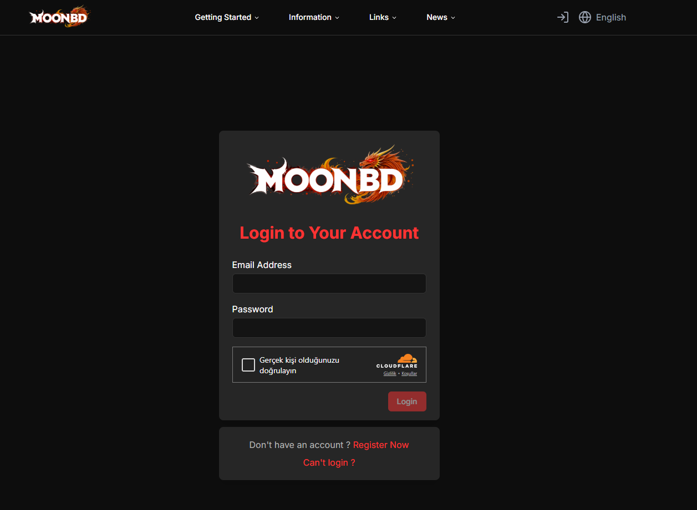
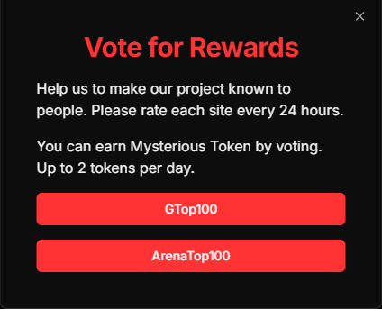

# 👆 Voting

### Vote for MoonBD 

Help us to make our project known to people. Please rate each site every 24 hours.

You can earn Mysterious Token by voting. Up to 2 tokens per day.

#### How to Participate


**Login website** [<mark style="color:red;">**here**</mark>](https://moonbd.online/)


<figure><figcaption></figcaption></figure>

<figure><figcaption></figcaption></figure>


Click on the word vote here and you will see a website where you can vote for 2 votes and win 2 mysterious tokens.


<figure><figcaption></figcaption></figure>

Your contributions are invaluable in helping us grow the MoonBD community. Thank you for your continued support!
