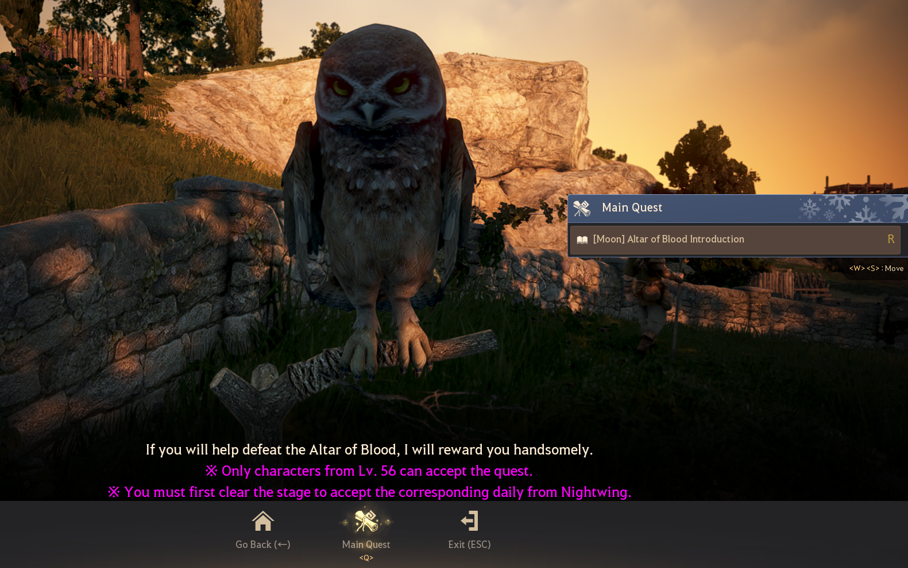

# 🩸 Altar of Blood

### **What is Altar Of Blood?**

Altar of Blood is a 2-3 member PvE mode where you defend a relic from waves of monsters. Waves come from four directions (Main side, left side, right side and back side) and players must use their skills to kill the monsters before they destroy the relic at the center. There is a total of 10 stages that get progressively harder.

### **Why should I do Altar Of Blood?**

Everyone should do each stage at least once for the challenge rewards. There are many rewards + Daily Repeatable quests from Joe that give many things.

<table><thead><tr><th>Illusion Stage</th><th>Regular Reward</th><th data-hidden>1-Time Reward</th></tr></thead><tbody><tr><td>The 1st Illusion - Savage</td><td>Heritage of the Forgotten - Savage | Cron Stones | Tungrad Ring</td><td>Cron Stone | Advice of Valks (+40) x1 | And More</td></tr><tr><td>The 2nd Illusion - Detest</td><td>Heritage of the Forgotten - Detest | Cron Stones | Tungrad Belt</td><td>Cron Stone | Shakatu's Shining Seal x5 | And More</td></tr><tr><td>The 3rd Illusion - Elusion</td><td>Heritage of the Forgotten - Elusion | Cron Stones | Black Distortion Earring</td><td>Cron Stone | Advice of Valks (+80) | And More</td></tr><tr><td>The 4th Illusion - Desire</td><td>Heritage of the Forgotten - Desire | Cron Stones | Black Distortion Earring</td><td>Cron Stone | Shakatu's Shining Seal x10 | And More</td></tr><tr><td>The 5th Illusion - Distrust</td><td>Heritage of the Forgotten - Distrust | Cron Stones | Black Distortion Earring</td><td>Cron Stone | Advice of Valks (+100) | And More</td></tr><tr><td>The 6th Illusion - Despair</td><td>Heritage of the Forgotten - Despair | Cron Stones | Laytenn's Power Stone  | Crescent Ring</td><td>Cron Stone | Shakatu's Shining Seal x15 | And More</td></tr><tr><td>The 7th Illusion - Oblivion</td><td>Heritage of the Forgotten - Oblivion | Cron Stones | Tungrad Ring | Basilisk's Belt | Sicil's Necklace</td><td>Cron Stone | Advice of Valks (+120) | And More</td></tr><tr><td>The 8th Illusion - Betrayal</td><td>Heritage of the Forgotten - Betrayal | Cron Stones | Tungrad Ring | Centaurus Belt | Laytenn's Power Stone | Basilisk's Belt</td><td>Cron Stone | Shakatu's Shining Seal x30 | And More</td></tr><tr><td>The 9th Illusion - Fear</td><td>Heritage of the Forgotten - Fear | Cron Stones | Deboreka Belt | Deboreka Necklace</td><td>Cron Stone | Advice of Valks (+150) | Blood-eyed Earrings (Limited) | And More</td></tr><tr><td>The 10th Illusion - Regret</td><td>Heritage of the Forgotten - Regret | Cron Stones | Deboreka Belt | Deboreak Earring | Deboreka Necklace</td><td>Cron Stone | Advice of Valks (+250) | Blood-eyed Visor (Limited) | Choice of any Potion Piece | And More</td></tr></tbody></table>

You also get Heritage of the Forgotten boxes from each stage, which can contain caphras stones, remnants of the rift, or even pre-enhanced TRI, TET, PEN gear at a low chance.

### Drops

.png>)[<mark style="color:yellow;">**Essence of Devouring**</mark>](https://bdocodex.com/us/item/65323/)

.png>)[<mark style="color:yellow;">**Embers of Resonance**</mark>](https://bdocodex.com/us/item/65318/)

.png>)<mark style="color:yellow;">**Cron Stone**</mark>

.png>)<mark style="color:$success;">**Ancient Spirit Dust**</mark>

.png>)<mark style="color:yellow;">**Sealed Black Magic Crystal**</mark>

.png>)<mark style="color:yellow;">**Nightmare Fragment**</mark>

.png>)<mark style="color:orange;">**Black Stone (Weapon)**</mark>

.png>)<mark style="color:orange;">**Black Stone (Armor)**</mark>

.png>)<mark style="color:yellow;">**Gold Bar 1G**</mark>

.png>)<mark style="color:yellow;">**Gold Bar 10G**</mark>

.png>)<mark style="color:yellow;">**Gold Bar 100G**</mark>

.png>)<mark style="color:yellow;">**Gold Bar 1,000G**</mark>

### **What do I need to do Altar Of Blood?**

Go Velia there is have Nightwing NPC for introduction Altar of blood get quest and obtain the nightmare fragment

<figure><figcaption></figcaption></figure>

### **How do I join Altar Of Blood?**

Once you form a party with 2-3 players who have completed the prerequisite questline, the leader can click on the Altar Of Blood icon in the menu (ESC->War->Altar Of Blood). If all members are eligible, the party will be teleported into the Altar of Blood. Attention: There is no confirmation message for the non-leader party members when you are about to be teleported in, so if you are a leader, make sure your whole party is ready.

Once you are inside, the leader needs to pick which stage he wants to start from by spending 50 energy and Nightmare fragments, in case he wants to start from a higher stage. Nightmare fragments are obtained from bosses or daily quests from Joe. This must be repeated for every stage, which means the leader spends 50 energy to initialize each stage, along with Nightmare Fragments for new ones. (You can retry a stage as many times as you'd like for just nightmare fragments, no energy cost.)

### **How do I prepare for Altar Of Blood?**

In the Altar Of Blood you CANNOT use your maids or tent. You are only allowed to configure your fairy or pets. This means that players should get enough _**HP and MP potions**_ to last them through the entire Altar Of Blood run as they cannot restock either through maids or tent. Also it is extremely important that players should stock up on _**Medical Kits**_ before starting Altar Of Blood, as it is the only way to resurrect. Team members Elion tears do NOT work in the Altar Of Blood.

Also, players are recommended to bring _**Nightmare Fragments**_ with them which can be easily obtained by the ways mentioned above. These allow the players to not only start from a later stage they have previously completed, **but also to retry a stage they failed**.

As for class, every class is perfectly viable in Altar Of Blood, but witch/wizard is recommended if you want to do the Laytenn boss of the final wave (see 10th stage of next section).

### **What should I be careful of during each stage of Altar of Blood?**

In this section, I will describe every stage of Altar Of Blood as well as the mechanics you should be careful of to avoid unnecessarily losing any rounds of Altar Of Blood.

**Stage 1:** In this stage Goblins come from each side to attack the relic. The goblins are extremely squishy and rather slow so you should have no issue, even at lower AP/DP. The boss in this stage is Giath. Overall, noone should have an issue with this stage, assuming your AP isnt ridiculously low. But do not get complacent!

**Stage 2:** In this stage Orcs come to attack the relic. As in the last stage, the mobs are squishy and die easily, nor do they deal very high damage. The only mobs you should be aware of are the \<Violent> Orc Wizards who have ranged attacks. If left unchecked they can overwhelm the relic since they do not group up like most melee mobs but sit at range. It is recommended you deal with those as soon as possible. The boss of this stage is Org. Overall, this stage should pose no challenge to most players.

**Stage 3:** In this stage you are first attacked by Skeleton Wolves. These look like fast dogs that run quickly towards the tower. However they dont deal particularly high damage, so you can just let them group up on the relic and AoE them. Afterwards, you are attacked by Skeletons, who are rather slow and witmirths. The Boss of this Stage is Hexe Marie.

**Stage 4:** In this stage you are attacked by Saunils. While at first this stage might seem as easy as the previous ones you have to be VERY careful as at certain points, while saunils are pouring in from the main side, Imp Bombers will start coming from the **side** directions. These imps are quite tanky but slow. You must kill them as soon as possible as if they reach a certain range from the relic they can deal high damage to it very quickly. **A single unnoticed bomber can very quickly wreck your relic**, and your run. However, as long as you notice and attack the bombers as soon as possible you should have no issue. The boss here is the Saunil Siege Captain.

**Stage 5:** In this stage you are attacked by Imps. They are not particularly hard. About halfway in the stage a Laytenn miniboss will spawn. You are recommended to burst him down when he spawns as he is particularly tanky. If you dont have the AP for that, try to focus on the mobs as Laytenn will prefer to attack the players instad of the relic. Otherwise, the stage has no special mechanics. The boss here is a classic Red Nose.

**Stage 6:** In this stage you are first attacked by Nagas from the right side. As they only come from the right side every player can focus on that side. After a few waves a Naga Gatekeeper will spawn. He is quite tanky but he focuses on the players rather than the relic so if you dont have the AP to burst him you dont have to focus on him instead of the mobs. Afterwards, Fogans will start pouring in from the left side, along with a Fogan Gatekeeper. If you have low AP you might end up with two Gatekeepers at the same time so try to burst them down as more will be pouring in later. After the fogans, Crescents along with a Crescent Gatekeeper will pour in from the back side. I hope you have enough AP to not end up with 3x Gatekeepers at the same time! Lastly, Cadries along with their Cadry Gatekeeper will come from the front side. The Cadry Gatekeeper is the final boss of this stage. The important thing in this stage is not to get overwhelmed and end up with too many gatekeepers at the same times as they can be a serious threat to you while you are defending your relic.

**Stage 7**: In this stage you are attacked by Sulfur Mine mobs. This stage is rather straightforward, except for the fact that a stronger version of bombers show up from the sides, namely Lava Faoluns. These little guys works similarly to the Imp bombers of the first stage except they are a little faster walkers. Try to be attentive of the side while mobs are pouring in from the front to take out these bombers before they get too close to the relic. If you can manage these bombers you should have no issue. The boss of this stage is Ferrid.

**Stage 8:** In this stage you are first attacked by Snakes and Basilisks. The snakes are rather fast but quite squishy. When the Basilisks start pouring in from the front side you should be careful because a Saunil Catapult will spawn. Once you see the catapult spawn you should destroy it as soon as possible as it can deal HEAVY damage to you and your relic at high range. After the basilisks, Centaurs will start pouring in. They are quite fast and deal a fair amount of damage so be on your toes. Again, a catapult will spawn halfway into the centaur wave. Try to destroy it ASAP. At the end you will be attacked by two bosses, a Centaur and a Basilisk. Try to kill the Centaur first as he is an archer with a particularly powerful nuke attack that can quickly kill players at low DP. Since he is the biggest threat try to focus him first. Overall, as long as you take care of the catapults and focus the centaur boss first you should have no issue.

**Stage 9:** From this stage things start to get challenging for players on the lower end of AP/DP. You are attacked by Aakman mobs. This stage is staightforward, except for the Kreators that spawn during the waves. Every few waves you will be attacks by 2x Kreators that get progressively larger. You should be extremely careful of these mobs as they possess attacks that can CC/bound you through protection and deal extremely high damage. If you dont have enough DP you are very likely to die to them if you are not careful. The boss is a large Kreator that is assisted by smaller Kreator mobs. Overall, what you should be careful of here is the Kreators that can kill players very fast.

**Stage 10:** This is the final stage, and the one you are most likely to fail even at high AP/DP if you dont know what you are doing. You will be attacked by Hystria mobs. Almost immediately into the stage 3x Eltens will spawn, 1 from each side. They are quite tanky. The mechanic is that these 3 eltens must die near the same time, so you should coordinate with your team to get them low and kill them almost at the same time. The timing is rather forgiving, as after dying they shut down for a reasonable time. IF they all die and get shut down at the same time, they die permanently otherwise they revive with full HP. While doing the Elten mechanic dont ignore the mobs that are attacking the tower however. Moreover, from the beginning Kutum will spawn and do his succ attack which you should avoid. After finishing the Elten mechanic the rest of the stage is straightforward until the boss (Laytenn) spawns.

Be EXTREMELY careful of this boss, as its attacks can oneshot even very high DP (380+) players and they tend to desync often. Since he is so dangerous you have two options.

_Option 1:_ The moment Laytenn spawns run to the Tunnel on the main side and wait. Every minute Kutum will appear to do his succ attack. Try to burst him at the end of his attack, when he becomes vulnerable. This should take a fair bit of time but it is worth it to avoid the risk that Laytenn poses. After a few times of Kutum spawning and you dpsing him during that brief window, he should die dropping the Heritage Of the Forgotten box and giving you credit for the completion of the Stage. **At no point before that should you aggro Laytenn.** After he dies (should take about 10-15 minutes) you are free to attempt Laytenn, who can drop another Heritage Of the Forgotten Box. Remember however that he is extremely dangerous and even high geared parties can die easily to him.

_Option 2:_ Engage Laytenn. This will be a lot faster than waiting for Kutum to spawn every minnute and dpsing him, but it's also a LOT riskier. A way to do this with significantly reduced risk is by having a Witch/Wizard in the party that can use his Red Orb taunt skill to keep the Laytenn busy. This should allow the party to DPS him safely. At about 40% HP laytenn will get stunned and kneel down which gives players a safe window to DPS him. In any case you should be very careful and try to not get hit by his attacks at all as he oneshots easily.

That's all for this introduction to Altar Of Blood, it's a very fun PvE gamemode that I very much recommend running.
