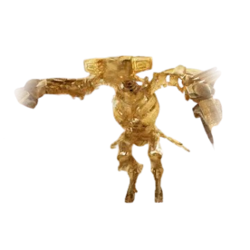

# Ancient Parrot

<figure><figcaption></figcaption></figure>

### Overview

**Ancient Parrot** is a custom World Boss on MoonBD that spawns periodically. 

---

### Spawn Details

* **Spawn Location:** Near Rakshan Observatory, close to Valencia City.
* **Spawn Calendar:** Specific spawn schedules are available on the [**Boss Calendar**](https://moonbd.online/boss-calendar).

<figure><figcaption></figcaption></figure>

---

### Drop Table

Drop table details, item rates, and direct NPC drop information are available on the [**Ancient Parrot Codex Page**](https://moonbd.online/codex/npc/900016).
