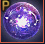
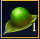
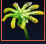
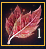
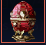
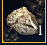
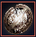
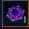
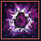

# 🪙 Gem of Fortune

### _<mark style="color:red;">**-Gem of Fortune Buff (Active for 30 Days);**</mark>_

* Central Market Auto Buy +20% tax bonus&#x20;
* Unlock a feature "Buy Items On Sale" in Central Market (Website)
* Unlock a feature to enable or disable Central Market Auto Buy (Website)

<figure><figcaption>
Detailed Description
</figcaption></figure>

### _<mark style="color:red;">**-How to obtain "Gem of Fortune"**</mark>__<mark style="color:red;">**;**</mark>_

You must vertically (Shape: | ) combine following items in your inventory;&#x20;

* Everlasting Flower&#x20;
* Lost Writings&#x20;
* Almighty Void&#x20;
* Egg of The Emperor

<figure><figcaption></figcaption></figure>

### -How to obtain Treasure Item Pieces;

You can obtain Treasure Item Pieces with their Pity Pieces (If you are not lucky enough).&#x20;

Obtain x100 Pity Pieces and do Simple Alchemy (L) with them to obtain Treasure Item Piece.

<table><thead><tr><th width="409">Pity Piece</th><th width="101">Quantity</th><th>Get Item</th></tr></thead><tbody><tr><td>Loopy Tree Forest's Bead (<a href="../../grindspots/mid-game/jade-starlight-forest.md">Jade Starlight Fores</a>t)</td><td>x100</td><td>Everlasting Flower</td></tr><tr><td>Mirage Leaf (<a href="../../grindspots/mid-game/stars-end.md">Star's End</a>)</td><td>x100</td><td>Egg of The Emperor</td></tr><tr><td>Soft Shiny Stone (<a href="../../grindspots/late-game/crypt-of-resting-thoughts.md">Crypt of Resting Thoughts</a>) </td><td>x100</td><td>Lost Writings</td></tr><tr><td>Fragment of Darkness (<a href="../../grindspots/late-game/elvia-calpheon-zone/">[Elvia] Calpheon</a>)</td><td>x100</td><td>Almighty Void</td></tr></tbody></table>
