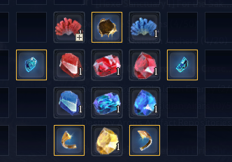
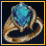
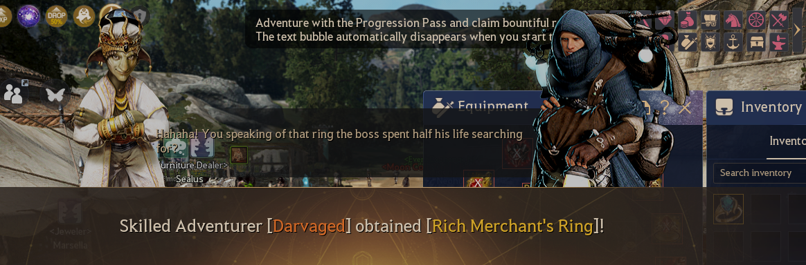

# 🪙 Rich Merchant's Ring


We have changed the look of the ring pieces so you would know exactly which one it is.


<figure><figcaption></figcaption></figure>

Then you can obtain Rich Merchant's Ring 

<figure><figcaption></figcaption></figure>
