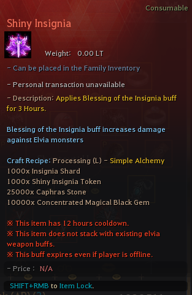

# 🪙 Shiny Insignia


If you wish to use multiple do it for different characters. Cooldown is not shared between characters so you can do that.


<mark style="color:purple;">**Shiny Insignia**</mark> effects;

* Gives Elvia weapon damage buff for Main and Awakening weapon
* 12 hours cooldown and lasts for 3 hours
* Gives buff for 3 hours as Elvia weapon buff with different buff name
* It can not be stacked with existing elvia weapon buffs and while you have insignia active if you take elvia weapon buff it will not apply
* It is a permanent item and will not disappear
* Expires even if player is offline

<figure><figcaption></figcaption></figure>

<mark style="color:purple;">**Shiny Insignia**</mark>

* 1000x <mark style="color:red;">**Insignia Shard**</mark>
* 1000x <mark style="color:blue;">**Shiny Insignia Token**</mark>
* 25000x <mark style="color:orange;">Caphras Stone</mark>
* 10000x <mark style="color:orange;">Concentrated Magical Black Gem</mark>
