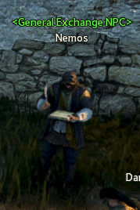
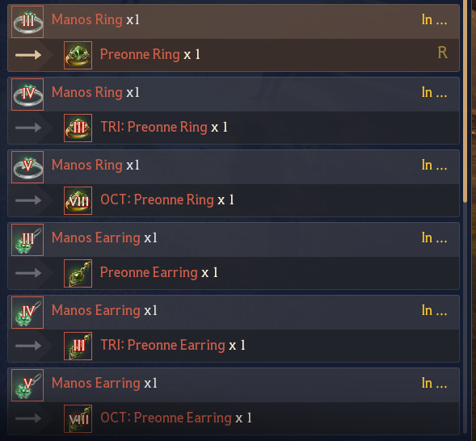

---
layout:
  width: default
  title:
    visible: true
  description:
    visible: true
  tableOfContents:
    visible: true
  outline:
    visible: true
  pagination:
    visible: true
  metadata:
    visible: true
---

# 🟩 Preonne Accesories

<mark style="color:purple;"><strong>Preonne Accesories</strong></mark>


In order to craft Preonne Accesories you need following the NPC Exchanges


<figure><figcaption></figcaption></figure>

In Velia you will see [<mark style="color:yellow;">**Nemos \<General Exchange NPC>**</mark>](../../../features/custom-npcs/nemos-less-than-general-exchanges-greater-than.md)

\ <mark style="color:$info;">**There have the Exchange for create Preonne Accesories**</mark>\

<figure><figcaption></figcaption></figure>

<figure><figcaption></figcaption></figure>

***


